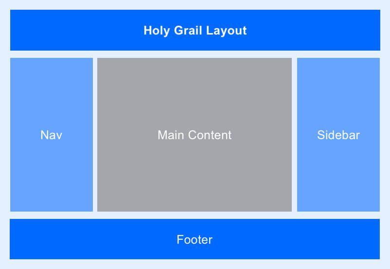

<h1>Task: Create a webpage using HTML and CSS that implements the "Holy Grail" layout.</h1>

Instructions:

<ul>
  <li>Use HTML and CSS to create a webpage with a header, footer, and main content area.</li>
  <li>The header and footer should remain in view at all times, even when the content is scrolled.(hint Position Fixed)</li>
  <li>The main content area should have a flexible layout that adjusts to the size of the user's screen.(Hint display flex)</li>
  <li>The layout should use CSS to ensure that the header and footer have a fixed height.</li>
  <li>Do not use JavaScript for this assignment.</li>
</ul>

Grading Criteria:

<ul>
  <li>Proper use of HTML and CSS</li>
  <li>Correct implementation of the "Holy Grail" layout</li>
  <li>Proper use of CSS to ensure the header and footer remain in view</li>
  <li>Effective use of CSS to create a flexible layout that adjusts to the screen size</li>
  <li>Absence of JavaScript.</li>
</ul>